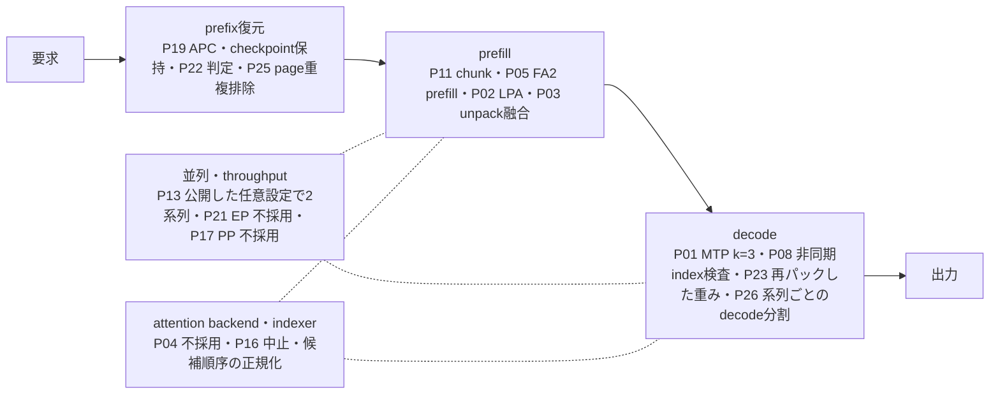

# 推論最適化の全体像

[English](optimization-overview.md) · [施策台帳](optimization-catalog.ja.md) · [文書一覧](README.ja.md)

どの施策が推論のどの段階に効き、それぞれがいまどこにあり、用途によってどの構成を選ぶかを一枚で示す読み物です。施策IDと採否の正典は[施策台帳](optimization-catalog.ja.md)、数値の正典はリンク先の各実測文書です。

## 基準構成

基準は[施策台帳の基準点](optimization-catalog.ja.md#今回の基準点と文書の役割)と同じで、context 16K・KV各rank 1 GiBで測定しています（[初期の測定条件](benchmarks.ja.md#初期の測定条件)）。32Kまでの独立容量評価は[32K sweep](benchmarks.ja.md#32kまでの独立コンテキスト評価p15)、従来の200K併用結果は[リリース候補の測定](benchmarks.ja.md#リリース候補の測定)を参照してください。256K・KV各3 GiBのテキスト専用構成は[256Kの実入力確認](benchmarks.ja.md#256kでの実入力確認)、現在の配布既定（画像入力あり）は[画像入力](vision.ja.md)を参照してください。

## 段階別の位置づけ

## 施策と現在地

「状態」は台帳の判断を短く言ったもので、日付・理由・再評価条件は台帳の行にあります。「既定」は配布既定 `examples/server.example.toml` の値です（[起動設定](server-configuration.ja.md#配布用の既定設定)）。公開した任意設定との差は[公開した任意設定と配布既定の差](server-configuration.ja.md#公開した任意設定と配布既定の差)にあります。機能受入・性能採用・既定値・併用検収は別々に判断されており、採用でも既定onとは限りません。用途別の有効化は[用途別の構成](#用途別の構成)を参照してください。

### prefix復元（繰り返す会話）

| 施策 | 仕組み | 状態 | 既定 | 正典 |
|---|---|---|---|---|
| P19 APC | 通常計算由来の状態だけを共有cacheに登録し、同一prefixのprefillを省略する | 実測した直列・長文prefix再利用の用途で受入（実験用）。cold要求は小幅に遅い | on（`cache.prefix_caching=true`） | [P19](benchmarks.ja.md#全モデルのprefix-caching独立評価p19) |
| checkpoint保持（`cache.prefix_cache_retention_interval`） | KDA checkpointをscheduler blockごとに保持し、途中編集・分岐後に復元できるHを伸ばす | 通常priming済み・直列の途中編集用途で採用。実測したarmは標準の間隔4,352。`dense`は実測した整列配置で同じ標準KDA maskになるが、最終併用の検収は別 | `dense`（キー省略時のruntime既定は0） | [保持A/B/A](benchmarks.ja.md#apcの履歴保持の基準検査)／[契約](launch-safety.ja.md#apcの履歴検証) |
| P22 APC優先LPA | 復元したHの先を、残余R＝N−T−Hが閾値Bを超えるときだけ近似する。近似状態は要求内に閉じる | 完了（校正・限定品質・最終併用・held-out）。B=128は保守的な候補閾値で、普遍的な損益分岐定数ではない | APCはon、LPAはoff（有効化時に `lpa.break_even_tokens=128` を適用） | [設計](apc-lpa-design.ja.md)／[校正](benchmarks.ja.md#apc優先lpaの損益分岐計測p22) |
| P25 page重複排除 | 既にcache済みのblockを持つhashで満杯のblockを登録せず、MTP下で再送した履歴が古い履歴を追い出さないようにする | 採用（1.9.0） | off。公開した任意設定ではon（`runtime.prefix_page_dedup`） | [1.9.0](benchmarks.ja.md#190での測定) |

### prefill

| 施策 | 仕組み | 状態 | 既定 | 正典 |
|---|---|---|---|---|
| P02 LPA | cut=32（0始まり）以降の層で過去tokenのMLPを省き、末尾512 tokenは通常計算。生成時は全層 | 実測あり（実験用。一般品質は別ゲート）。長文照合・tool往復は合格 | off。バッチ用opt-in（`lpa.enabled=true`）——近似要求は共有prefixを公開しないため。FA2 prefillと排他 | [LPA](lpa.ja.md) |
| P03 unpack融合 | FP8 MLA cacheの復元（コピー・FP32変換・scale乗算）をTriton 1 kernelに | 実測あり（部品一致・全モデルA/B/A。受入済みのP18併用の範囲で使用） | on（`cache.fused_unpack=true`） | [部品実測](component-validation.ja.md) |
| P11 prefill chunk | schedulerのtoken予算を、2系列と、1系列の200K profileで比較 | 既定2048、128は不採用。2系列ではchunkが長いほど最長停止が延びる | 2048（`context.max_num_batched_tokens`） | [P11](benchmarks.ja.md#prefill-chunk-の独立評価p11)／[200K](benchmarks.ja.md#200k画像profileでのchunk予算2026-09-17) |

### decode

| 施策 | 仕組み | 状態 | 既定 | 正典 |
|---|---|---|---|---|
| P01 MTP k=3 | checkpoint同梱のBF16 draftを別メタデータviewで読み、3 token先読み。外部draftモデルなし | 深さ1〜5を測り、両方のcheckpointでk=3を選定。採択の履歴による深さ、draftの確信度の関門、draft側の設定二つは測って不採用 | on（`mtp.enabled=true`、`num_speculative_tokens=3`） | [両方のcheckpointで深さ3](speculative-decoding.ja.md#両方のcheckpointで深さ32026-09-21)／[固定の深さの先](speculative-decoding.ja.md#固定の深さの先2026-09-21) |
| P08 非同期index検査 | 範囲検査を省かずGPU assertへ移し、hostとの同期・copyを減らす代わりにGPU kernelが少し増える | 受入（独立opt-in） | async（`runtime.index_checks`） | [P08](benchmarks.ja.md#cpu同期削減の独立評価p08) |
| P06 CUDA Graphs | decodeのみcapture／replay | 不採用（2026-09-21）：全モデルでeagerより1 stepあたり遅い。選択肢としては残し、後のruntimeで測り直す | off（`runtime.decode_graphs=false`） | [Graph fixture](component-validation.ja.md#decode-graphのfixture独立評価)／[全モデル](benchmarks.ja.md#全モデルでのdecode-graphs) |
| P23 再パックした重み | attention projectionと `lm_head` をW4A16 NVFP4に再パック（route l）し、`runtime.derived_checkpoint` で配信 | 公開した任意設定として採用。losslessではないので配布既定には入れない | off。公開した任意設定ではon | [台帳](optimization-catalog.ja.md#性能施策一覧)／[配信profile](benchmarks.ja.md#基準の2台の配信profileattentionと-lm_head-の再パック深さ3) |
| P26 系列ごとのdecode分割 | sparse MLA decodeの分け方を、step全体ではなく1系列のtoken数から決める | 採用（1.14.0）：要求のattentionが、stepを共有する他の要求に依らなくなる | on（`runtime.mla_decode_cpb`） | [1.14.0](benchmarks.ja.md#1140での測定) |

### 並列・throughput

| 施策 | 仕組み | 状態 | 既定 | 正典 |
|---|---|---|---|---|
| P13 標準batching | `max_num_seqs=2`で実batch重複を作る。LPAは1系列限定 | 公開した任意設定は2系列を配信（2026-09-23受入、1要求あたり約200K tokenまで）。どんな負荷でもcompletionが反復するのは1系列のときだけ（[同時実行の範囲](validation.ja.md#同時実行の範囲)） | 1系列（`context.max_num_seqs=1`）。公開した任意設定では2 | [P13](benchmarks.ja.md#標準batchingの独立評価) |
| P21 Expert Parallel | Expert層の分割だけをTPからEPへ | 不採用（実測したthroughput負荷） | off（`runtime.expert_parallel=false`） | [P21](benchmarks.ja.md#expert-parallel-の独立評価p21) |
| P17 TP2／PP2 | 同じ2台をTP1×PP2に | 不採用（実測した生成負荷） | TP2（`runtime.pipeline_parallel_size=1`） | [P17](benchmarks.ja.md#tp2pp2の独立評価p17) |
| P14 同種タスクbatching | 投入順を同種でまとめる | 不採用（この負荷） | —（設定項目なし） | [P14](benchmarks.ja.md#同種タスクの投入順比較p14) |

### attention backend・indexer

| 施策 | 仕組み | 状態 | 既定 | 正典 |
|---|---|---|---|---|
| P04 NoPE attention融合 | Pythonのqueryループと多段演算の置換 | 不採用（launch削減だけでは速くならず） | —（serving未接続） | [P04](component-validation.ja.md#nope-attentionの融合とquery-batchingp04) |
| P05 FA2 prefill（SM121 backend選定） | prefillの大きさのNoPE attentionを、BF16に展開した行でFlashInferのSM90 FA2 wrapperに通す。SM120の直接差し替えは不採用 | prefillに採用（1.6.0） | on（`runtime.fa2_attention`）。decodeは参照経路、LPAと排他 | [1.6.0](benchmarks.ja.md#160でのprefillとdecode)／[SM90 FA2](component-validation.ja.md#sm90-fa2-mla-wrapperの試験)／[SM120の試験](component-validation.ja.md#padding付きnative-attentionの直接試験) |
| P16 CSA2 | 層間の候補再利用・限定再採点 | 第一の門で中止（2026-09-21）：indexerがprefillに占める割合が小さすぎる。部品は保持 | —（未統合） | [CSA2](indexer-reuse.ja.md) |
| 候補順序の正規化 | sparse MLA候補を物理index変換前に論理token順へ揃え、top-kの順序揺れを除く | 台帳外：すべての参照imageが持つruntimeの修正。上記の初期比較は変更前 | on（参照image） | [候補順序](candidate-order.ja.md) |

### 運用（性能施策ではない）

認証クライアント・allocator伝達・レール検査・両rank切替は運用の契約であり、高速化ではありません。[施策台帳](optimization-catalog.ja.md)が既存のIDの下に整理し、[起動契約](launch-safety.ja.md)が所有します。

## 直列併用の実測

併用状態は併用状態として実測しています。

- **P18** MTP3＋unpack融合＋非同期検査を固定し、LPA off／on／復帰を比較。LPA追加分は2K／8Kの1出力で約15%／19%、128出力で約9%／13%。24課題でLPAだけが落ちる回帰は0件。[P18](benchmarks.ja.md#直列併用の評価p18)
- **P22最終併用** 上記にAPC・LPA cut32／tail512／B128を加え、KV各rank 2 GiB。24課題は通常21／LPA24／復帰23、held-out 8文書は7／8／8。[P22併用](benchmarks.ja.md#apclpamtp融合非同期検査の併用p22)
- **保持を含む最終回帰** さらに`dense`保持を加えた最終imageで、2K／8K（H=0）と16K（H=4,608）の128出力を3回測定。保持A/B/Aとは反復数・比較対象が異なるため、性能採用の根拠ではなく回帰確認です。[最終回帰](benchmarks.ja.md#保持候補を含む最終併用の回帰)

## 用途別の構成

全機能有効が常に最速ではありません。同一入力を繰り返す条件では、MTP併用がMTPなしより128出力で遅くなり、MTPの復帰境界によって再利用できる入力が短くなっていました。KV予算・kernel設定も異なる構成全体の比較であり、MTP単独のコスト推定ではありません。[同一入力再利用の差](benchmarks.ja.md#同一入力を再利用する場合の差)

| 用途 | 構成 | 根拠 | 注意 |
|---|---|---|---|
| 生成重視・直列（コード。配布既定） | 固定のcheckpoint、MTP k=3、unpack融合、非同期検査、FA2 prefill、APC、1系列 | [配布用の既定設定](server-configuration.ja.md#配布用の既定設定) | 1系列で通常運用として受入（[SETUP手順6](../SETUP.ja.md#6-フルモデルの検証)）。固定の重みに対してlossless |
| 日本語散文 | 公開した任意設定（NVFP4 BIZ AXL） | [公開した任意設定と配布既定の差](server-configuration.ja.md#公開した任意設定と配布既定の差)／[配信profile](benchmarks.ja.md#基準の2台の配信profileattentionと-lm_head-の再パック深さ3) | losslessではない。その費用はREADMEの比較にある（[確認した範囲](../README.ja.md#確認した範囲)） |
| 長い入力のバッチprefill | MTP k=3＋unpack融合＋非同期検査＋LPA cut32／tail512、FA2 prefillはoff、APCは任意 | P18／P22最終併用 | LPAはバッチ用opt-inで近似、FA2 prefillと排他、共有prefixの再利用を失う |
| prefix再利用重視 | APC＋LPA（P22、B=128）＋`dense`保持、MTPなし | 同一入力再利用・途中編集のA/B/A | 通常primingで共有cacheを育てる。cold処理は小幅悪化 |
| throughput | 2系列：公開した任意設定のexample | [同時実行の範囲](validation.ja.md#同時実行の範囲) | 要求が重なると処理量が増える。completionは同時に走る要求に依る。LPAは1系列限定。さらに系列を増やすにはrankを増やす |
| 基準・切り分け | 全てoff、eager、1系列 | 基準ベンチ | 比較用。検収した配信profileではない |

いずれも[起動設定TOML](server-configuration.ja.md)の`[mtp]`・`[lpa]`・`[cache]`・`[context]`・`[runtime]`で切り替え、対応imageのmarkerが必要です。

## 性能と容量のQ&A

現在の構成を拡張するときの考え方を整理します。配信する二つのprofileはどちらも要求あたり入出力合計262,144 tokenが上限で、1Mは約100万tokenです。1Mと3系列以上は未検収、2系列は公開した任意設定でだけ検収済みです（[同時実行の範囲](validation.ja.md#同時実行の範囲)）。

### Q. KVキャッシュを各rankに3 GiB確保すれば、256Kコンテキストを継続して利用できますか？

**KV容量の観点では、現在と同じモデル・cache精度・MTP/LPA・並列方式・同時1系列なら、基本的にははい。** tokenが表す文字列によって、token当たりのKVの形式やサイズが変わるわけではありません。入力と生成の合計が上限内であることが条件です。[256Kの実入力確認](benchmarks.ja.md#256kでの実入力確認)で、この構成の容量と限定参照を検証しています。

APCの履歴・分岐・checkpoint保持、blockの整列、同時数を変えた場合は、必要な状態と割当も確認します。KV以外の作業領域や他プロセスのRAM使用も変動するため、KVの収容条件と無停止運用の保証は分けて判断してください。[KV容量とRAMの条件](server-configuration.ja.md#kv容量とramの条件)

### Q. KVキャッシュを各rankに12.5 GiB用意できれば、1Mコンテキストを利用できますか？

**固定の重みで2台なら、できません。** 派生checkpointなしでは、ランチャーはrankあたり3 GiBを超えるKVを拒否します（`check_kv_budget`）。固定の重みでは、headに保護余裕を上回る余地がほとんど残らないためです（[KV容量とRAMの条件](server-configuration.ja.md#kv容量とramの条件)）。再パックした重みは軽く、6 GiBを配信しており、これがここで測った最大の予算です。12.5 GiBは未検証で、他所でメモリを空ける（次の問い）か、rankを増やす（TP=4、[同時実行の範囲](validation.ja.md#同時実行の範囲)）必要があります。

必要量そのものも、256Kの量から長さに比例して決まるわけではありません。GLMはtoken数に応じる状態と固定量の再帰状態を併用し、blockの整列やcheckpoint保持もあるため、固定runtimeのcache groupと状態slot数から確認します。そのKV枠とは別に、重み・activation・indexerの一時領域・OS等のRAMが必要です。KVの確保、機体全体のRAMへの収容、1Mの実要求の完了を順に検証します。

### Q. MTPを無効化し、保護用のメモリ余裕を減らせば、1M運用は可能でしょうか？

**検証する自然な候補です。ただし再パックした重みか、rankを増やした構成で。** MTPを無効にすると[実測したdraftのメモリ](speculative-decoding.ja.md#k1の実測結果)が空きます。固定量で、コンテキストを伸ばしても大きくなりません。固定の重みでは、MTPの有無にかかわらず、ランチャーは3 GiBを超えるKVを拒否します。

以前のprofileから外挿せず、公開した任意設定の実測メモリ（[1.10.2での測定](benchmarks.ja.md#1102での測定)）から出発し、実際に必要なKVを見積もって、長文用の追加作業領域まで収めます。保護余裕を減らす設定は、残す余白を小さくするものであり、RAM自体を増やすものではありません。

### Q. 1Mコンテキストでは、どの程度の待ち時間を見込む必要がありますか？

**初回やprefix cacheが効かない要求では、入力処理（prefill）に長く待つ可能性があります。数十分単位はありうる規模で、実測ではありません。** 約200Kの要求は、配信するどちらのprofileでも約3分です（[主要な測定値](../README.ja.md#確認した範囲)）。

これは1Mの実測時間やTTFTの保証ではありません。構成変更、計算量の増え方、workspaceやメモリ帯域によってさらに延びる可能性があります。再利用できるprefixがあれば待ちを短縮できる場合がありますが、長い入力を毎回読み直す対話では、この待ち時間が実用上の制約になります。

### Q. KVキャッシュを各rankに5 GiBへ増やすと、複数同時実行やEP・PPが有効になる可能性はありますか？

**固定の重みでは5 GiBは拒否されます。公開した任意設定は、すでに6 GiBから2系列を配信しています。** その受入は1要求あたり約200K tokenまでで、completionは同時に走る要求に依ります。最大長の要求2本の同時は未測定です（[同時実行の範囲](validation.ja.md#同時実行の範囲)）。LPAは1系列限定です。さらに系列を増やすにはrankを増やします（TP=4）。

batchが大きくなればexpert計算の効率やpipelineの稼働率が改善する可能性がある一方、通信やstage間の待ちも増えます。過去の測定負荷では[EP](benchmarks.ja.md#expert-parallel-の独立評価p21)・[PP](benchmarks.ja.md#tp2pp2の独立評価p17)を速度面で不採用としました。同時数や負荷を変えて評価する価値はありますが、KVの増量だけで高速化が決まるわけではありません。

## 読み替えの禁止事項

- 別実験の改善率を足さない・掛けない。imageや入力・KV予算は実験ごとに異なる
- 部品や小層fixtureの合格を全モデルへ繰り上げない
- 機能受入／性能採用／既定on・off／併用検収を分けて読む
- 初期比較のimageと、候補順序の正規化後の併用回帰・リリース候補測定を区別する
- FreedomBenchの満点、限定課題の正答、fixtureの一致は、一般品質や本番信頼性の証明ではない

## 次の候補

- P24 要求単位のprefix cache無登録：必要性は実測済み、未着手（[台帳](optimization-catalog.ja.md#性能施策一覧)）
- Euryale：本リポジトリ外の投機draft研究（[README](../README.ja.md#本リポジトリ外の関連研究)）
- P09 FP8／BF16 KVのA/B、P20 indexer workspace、256Kを超えるcontextと長文の検証範囲拡大、複数系列×LPA
- 固定版vLLM：source-pinnedのpatch（[構成](architecture.ja.md)）は、上流の修正を含む新しい固定版へ移る時に外す。その移行は上の施策すべての再検収を伴う
