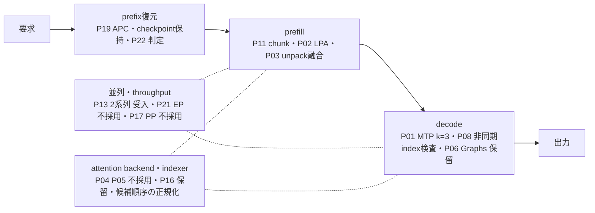

# 推論最適化の全体像

[English](optimization-overview.md) · [施策台帳](optimization-catalog.ja.md) · [文書一覧](README.ja.md)

どの施策が推論のどの段階に効き、何を採用し、用途によってどの構成を選ぶかを一枚で示す読み物です。施策IDと採否の正典は[施策台帳](optimization-catalog.ja.md)、数値の正典は各実測文書で、本書の数値は条件付きの代表値です。数値を引用する際はリンク先の表と条件を確認してください。

## 基準構成

基準は[施策台帳の基準点](optimization-catalog.ja.md#今回の基準点と文書の役割)と同じで、context 16K・KV各rank 1 GiBで測定しています（[初期の測定条件](benchmarks.ja.md#初期の測定条件)）。32Kまでの独立容量評価は[32K sweep](benchmarks.ja.md#32kまでの独立コンテキスト評価p15)、従来の200K併用結果は[リリース候補の測定](benchmarks.ja.md#リリース候補の測定)を参照してください。256K・KV各3 GiBのテキスト専用構成は[256Kの実入力確認](benchmarks.ja.md#256kでの実入力確認)、現在の配布既定（200K・画像入力・KV各2.5 GiB）は[200Kでの画像入力](vision.ja.md)を参照してください。

## 段階別の位置づけ

## 施策と現在地

「採否」は台帳の判断（採用／受入／保留／不採用）、「既定」は[起動設定TOML](server-configuration.ja.md)の既定値です。機能受入・性能採用・既定値・併用検収は別々に判断されており、採用でも既定onとは限りません。用途別の有効化は[用途別の構成](#用途別の構成)を参照してください。

### prefix復元（繰り返す会話）

| 施策 | 仕組み | 採否 | 既定 | 代表値と条件 | 正典 |
|---|---|---|---|---|---|
| P19 APC | 通常計算由来の状態だけを共有cacheに登録し、同一prefixのprefillを省略する | 受入（実測した直列・長文prefix再利用の実験用途） | on（`cache.prefix_caching=true`） | 16,320入力の再要求で約79%短縮。2Kは改善なし、長文2件のcoldは1.1〜1.7%悪化 | [P19](benchmarks.ja.md#全モデルのprefix-caching独立評価p19) |
| checkpoint保持（`cache.prefix_cache_retention_interval`） | KDA checkpointをscheduler blockごとに保持し、途中編集・分岐後に復元できるHを伸ばす | 採用（通常priming済み・直列の途中編集用途）。実測したarmは標準の間隔4,352。`dense`は実測した整列配置で同じ標準KDA maskになるが、最終併用の検収は別 | `dense`（キー省略時のruntime既定は0） | 約16K入力の50%位置編集・1出力で約27.6%短縮（A/B/A各5回）。編集・分岐・追記・別会話再訪・evictionの履歴試験を通過 | [保持A/B/A](benchmarks.ja.md#apcの履歴保持の基準検査)／[契約](launch-safety.ja.md#apcの履歴検証) |
| P22 APC優先LPA | 復元したHの先を、残余R＝N−T−Hが閾値Bを超えるときだけ近似する。近似状態は要求内に閉じる | 完了（校正・限定品質・最終併用・held-out）。B=128は保守的な候補閾値で、普遍的な損益分岐定数ではない | APCはon、LPAはテンプレートでoff（有効化時に `lpa.break_even_tokens=128` を適用） | H=0／4,352の12条件すべてでLPAが両対照より速い | [設計](apc-lpa-design.ja.md)／[校正](benchmarks.ja.md#apc優先lpaの損益分岐計測p22) |

### prefill

| 施策 | 仕組み | 採否 | 既定 | 代表値と条件 | 正典 |
|---|---|---|---|---|---|
| P02 LPA | cut=32（0始まり）以降の層で過去tokenのMLPを省き、末尾512 tokenは通常計算。生成時は全層 | 実測あり（実験用。一般品質は別ゲート） | 既定off。バッチ用opt-in（`lpa.enabled=true`）——近似要求は共有prefixを公開しないため | 8,192入力・1出力で約21.6%短縮（単独）。長文照合6件・tool往復は合格 | [LPA](lpa.ja.md) |
| P03 unpack融合 | FP8 MLA cacheの復元（コピー・FP32変換・scale乗算）をTriton 1 kernelに | 実測あり（部品一致・全モデルA/B/A。受入済みのP18併用の範囲で使用） | on（`cache.fused_unpack=true`） | 8Kの1出力対照で約17%短縮。短文decodeはほぼ不変 | [部品実測](component-validation.ja.md) |
| P11 prefill chunk | schedulerのtoken予算を128／512／1024で比較 | 既定512を維持。1024はthroughput候補、128は不採用 | 512（`context.max_num_batched_tokens`） | 1024は2Kの全体出力を約4.6%（1クライアント）／5.7%（2クライアント）改善するが最長停止が延びる | [P11](benchmarks.ja.md#prefill-chunk-の独立評価p11) |

### decode

| 施策 | 仕組み | 採否 | 既定 | 代表値と条件 | 正典 |
|---|---|---|---|---|---|
| P01 MTP k=3 | checkpoint同梱のBF16 draftを別メタデータviewで読み、3 token先読み。外部draftモデルなし | 選定（次の実験ではk=3を優先。k=2／k≥4は未試験） | on（`mtp.enabled=true`、`num_speculative_tokens=3`） | 短文decodeはk=1→k=3で24.1 → 30.3 token/s、その前のoff→k=1で14.3 → 24.1（1系列、別実行の比較）。長文の全体throughputはほぼ不変、TTFTは微増、約7 GiB/rank追加 | [k=3](speculative-decoding.ja.md#k3の比較結果)／[k=1](speculative-decoding.ja.md#k1の実測結果) |
| P08 非同期index検査 | 範囲検査を省かずGPU assertへ移す。tokenあたりCPU同期は各rankで約22回、copyは両rank合計で約22回減り、GPU kernelは11回増える | 受入（独立opt-in） | async（`runtime.index_checks`） | 128出力で約0.7〜2.5%の小幅改善、短文ほど大きい | [P08](benchmarks.ja.md#cpu同期削減の独立評価p08) |
| P06 CUDA Graphs | decodeのみcapture／replay | 保留（全モデル未検収。小層fixtureで2K入力の生成が分岐） | off（`runtime.enforce_eager=true`） | — | [Graph fixture](component-validation.ja.md#decode-graphのfixture独立評価) |

### 並列・throughput

| 施策 | 仕組み | 採否 | 既定 | 代表値と条件 | 正典 |
|---|---|---|---|---|---|
| P13 標準batching | `max_num_seqs=2`で実batch重複を作る。LPAは1系列限定 | 受入（限定throughput用途） | 1系列（`context.max_num_seqs=1`） | 16K×2の容量も確認 | [P13](benchmarks.ja.md#標準batchingの独立評価) |
| P21 Expert Parallel | Expert層の分割だけをTPからEPへ | 不採用（実測したthroughput負荷） | off（`runtime.expert_parallel=false`） | 全4ケースで両off対照より遅い | [P21](benchmarks.ja.md#expert-parallel-の独立評価p21) |
| P17 TP2／PP2 | 同じ2台をTP1×PP2に | 不採用（実測した生成負荷） | TP2（`runtime.pipeline_parallel_size=1`） | prefillは改善、decodeは低下。profiler再開始の障害でPP容量・decode traceは未完了 | [P17](benchmarks.ja.md#tp2pp2の独立評価p17) |
| P14 同種タスクbatching | 投入順を同種でまとめる | 不採用（この負荷） | —（設定項目なし） | 改善は約0.7〜0.9% | [P14](benchmarks.ja.md#同種タスクの投入順比較p14) |

### attention backend・indexer

| 施策 | 仕組み | 採否 | 既定 | 正典 |
|---|---|---|---|---|
| P04 NoPE attention融合 | Pythonのqueryループと多段演算の置換 | 不採用（launch削減だけでは速くならず） | —（serving未接続） | [P04](component-validation.ja.md#nope-attentionの融合とquery-batchingp04) |
| P05 SM121 backend選定 | 既存kernelへの候補幅適合 | 不採用（候補幅2176非対応・数値未達） | —（参照attentionを維持） | [部品検査](component-validation.ja.md#padding付きnative-attentionの直接試験) |
| P16 CSA2 | 層間の候補再利用・限定再採点 | 保留（部品保持、serving適用なし） | —（未統合） | [CSA2](indexer-reuse.ja.md) |
| 候補順序の正規化 | sparse MLA候補を物理index変換前に論理token順へ揃え、top-kの順序揺れを除く | 台帳外：新規ビルドの参照imageで有効なruntime共通の修正。上記の初期比較は変更前。正規化後の全モデル併用回帰と[256Kの実測](benchmarks.ja.md#256kでの実入力確認)は別に記録。再ビルドしたruntimeにも検収が要る | on（新規ビルドの参照image） | [候補順序](candidate-order.ja.md) |

### 運用（性能施策ではない）

認証クライアント・allocator伝達・全HCA（レール）検査・両rank切替と復旧は運用の契約であり、高速化ではありません。[施策台帳](optimization-catalog.ja.md)はP10／P19／P22／E03の拡張として扱い、範囲と切替・復旧の制御試験の証拠は[起動契約](launch-safety.ja.md)が所有します。

## 直列併用の実測

単体の改善率を足したり掛けたりせず、併用状態を実測しています。

- **P18** MTP3＋unpack融合＋非同期検査を固定し、LPA off／on／復帰を比較。LPA追加分は2K／8Kの1出力で約15%／19%、128出力で約9%／13%。24課題でLPAだけが落ちる回帰は0件。[P18](benchmarks.ja.md#直列併用の評価p18)
- **P22最終併用** 上記にAPC・LPA cut32／tail512／B128を加え、KV各rank 2 GiB。24課題は通常21／LPA24／復帰23、held-out 8文書は7／8／8。[P22併用](benchmarks.ja.md#apclpamtp融合非同期検査の併用p22)
- **保持を含む最終回帰** さらに`dense`保持を加えた最終imageで、2K／8K（H=0）と16K（H=4,608）の128出力を3回測定。保持A/B/Aとは反復数・比較対象が異なるため、性能採用の根拠ではなく回帰確認です。[最終回帰](benchmarks.ja.md#保持候補を含む最終併用の回帰)

## 用途別の構成

全機能有効が常に最速ではありません。同一入力を繰り返す条件では、MTP併用がMTPなしより128出力で約20.6%（8,192入力）／28.4%（16,320入力）遅くなり、MTPの復帰境界によって再利用できる入力が短くなっていました。KV予算・kernel設定も異なる構成全体の比較であり、MTP単独のコスト推定ではありません。[同一入力再利用の差](benchmarks.ja.md#同一入力を再利用する場合の差)

| 用途 | 構成 | 根拠 | 注意 |
|---|---|---|---|
| 生成重視・直列 | MTP k=3＋unpack融合＋非同期検査＋LPA cut32／tail512、APCは任意 | P18／P22最終併用 | 1系列・eager。LPAはバッチ用opt-in（テンプレートではoff）で、共有prefixの再利用を失う。業務検収・ハーネスは未了 |
| prefix再利用重視 | APC＋LPA（P22、B=128）＋`dense`保持、MTPなし | 同一入力再利用・途中編集のA/B/A | 通常primingで共有cacheを育てる。cold処理は小幅悪化 |
| throughput | 2系列、LPAなし、chunk 512（停止延長を許容するなら1024） | P13／P11 | LPAは1系列限定。4系列以上は未検収 |
| 基準・切り分け | 全てoff、eager、1系列 | 基準ベンチ | 常用検収は未了 |

いずれも[起動設定TOML](server-configuration.ja.md)の`[mtp]`・`[lpa]`・`[cache]`・`[context]`・`[runtime]`で切り替え、対応imageのmarkerが必要です。

## 性能と容量のQ&A

現在の構成を拡張するときの考え方を整理します。256Kのテキスト専用構成は入出力合計262,144 token（配布の画像入力構成は204,800）、1Mは約100万tokenです。1Mや新しい複数系列構成は未検収です。

### Q. KVキャッシュを各rankに3 GiB確保すれば、256Kコンテキストを継続して利用できますか？

**KV容量の観点では、現在と同じモデル・cache精度・MTP/LPA・並列方式・同時1系列なら、基本的にははい。** tokenが表す文字列によって、token当たりのKVの形式やサイズが変わるわけではありません。入力と生成の合計が上限内であることが条件です。[256Kの実入力確認](benchmarks.ja.md#256kでの実入力確認)で、この構成の容量と限定参照を検証しています。

APCの履歴・分岐・checkpoint保持、blockの整列、同時数を変えた場合は、必要な状態と割当も確認します。KV以外の作業領域や他プロセスのRAM使用も変動するため、KVの収容条件と無停止運用の保証は分けて判断してください。[KV容量とRAMの条件](server-configuration.ja.md#kv容量とramの条件)

### Q. KVキャッシュを各rankに12.5 GiB用意できれば、1Mコンテキストを利用できますか？

**KVの収容量としては有望な検証候補です。** GLMはtoken数に応じる状態と固定量の再帰状態を併用し、blockの整列やcheckpoint保持もあるため、従来の200K設定から見積もった必要量が厳密な5倍になるわけではありません。12.5 GiBより少なく済む可能性もあります。固定runtimeのcache groupと状態slot数から確認します。

そのKV枠とは別に、重み・activation・indexerの一時領域・OS等のRAMが必要です。KVの確保、機体全体のRAMへの収容、1Mの実要求の完了を順に検証します。

### Q. MTPを無効化し、保護用のメモリ余裕を減らせば、1M運用は可能でしょうか？

**見込みはあり、1Mを検証する際の自然な候補です。** MTPを無効にすると、[実測ではモデル用メモリを各rank約7 GiB](speculative-decoding.ja.md#k1の実測結果)削減できます。MTPの重みは固定量で、コンテキストを伸ばしても比例して大きくなりません。

従来の200K構成を基準に、KVを2.5→12.5 GiBへ増やすなら追加は10 GiBです。[その構成の最小空きRAM](benchmarks.ja.md#200kでの実入力確認)を約5.2 GiBとして単純計算すると、`5.2 + 7 − 10 ≈ 2.2 GiB`しか残りません。これは長文用workspaceの増分を含まない概算です。実際に必要なKVを見積もり、追加作業領域まで収めることが鍵になります。保護余裕を減らす設定は、残す余白を小さくするものであり、RAM自体を増やすものではありません。

### Q. 1Mコンテキストでは、どの程度の待ち時間を見込む必要がありますか？

**初回やprefix cacheが効かない要求では、入力処理（prefill）に長く待つ可能性があります。数十分単位を想定する規模です。** 従来の[200Kの実測](benchmarks.ja.md#200kでの実入力確認)は入力処理を含む要求全体で約8分であり、単純に5倍した規模感でも約40分です。

これは1Mの実測時間やTTFTの保証ではありません。構成変更、計算量の増え方、workspaceやメモリ帯域によってさらに延びる可能性があります。再利用できるprefixがあれば待ちを短縮できる場合がありますが、長い入力を毎回読み直す対話では、この待ち時間が実用上の制約になります。

### Q. KVキャッシュを各rankに5 GiBへ増やすと、複数同時実行やEP・PPが有効になる可能性はありますか？

**複数同時実行を検証する余地が広がり、EP・PPを再評価する理由になります。** KVを増やせば最大長の要求を必ず2本保持できるという保証ではないため、系列ごとの状態と、入出力合計長×同時数の実要求を確認します。現行LPAは1系列限定なので、まずLPAなしの構成から検証し、MTPとの複数系列併用も別に確認します。

batchが大きくなればexpert計算の効率やpipelineの稼働率が改善する可能性がある一方、通信やstage間の待ちも増えます。過去の測定負荷では[EP](benchmarks.ja.md#expert-parallel-の独立評価p21)・[PP](benchmarks.ja.md#tp2pp2の独立評価p17)を速度面で不採用としました。同時数や負荷を変えて評価する価値はありますが、KVの増量だけで高速化が決まるわけではありません。

## 読み替えの禁止事項

- 別実験の改善率を足さない・掛けない。imageや入力・KV予算は実験ごとに異なる
- 部品や小層fixtureの合格を全モデルへ繰り上げない
- 機能受入／性能採用／既定on・off／併用検収を分けて読む
- 初期比較のimageと、候補順序の正規化後の併用回帰・リリース候補測定を区別する
- FreedomBenchの満点、限定課題の正答、fixtureの一致は、一般品質や本番信頼性の証明ではない

## 次の候補

- P06 Graphs：LPAのeager制約を解く検証と全モデル受入
- Euryale：本リポジトリ外の投機draft研究（非公開・独立プロジェクト）。標準MTP k=3との同条件比較で品質・性能・メモリ・復旧のゲートを通した場合に限り、既定の投機経路を置き換える候補。全モデルの教師採取・学習は未着手
- P09 FP8／BF16 KVのA/B、P20 indexer workspace、256Kを超えるcontextと長文の検証範囲拡大、複数系列×LPA
