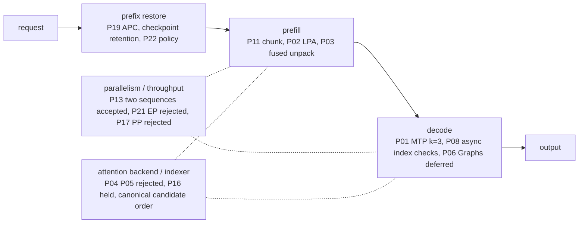

# Inference optimization overview

[日本語](optimization-overview.ja.md) · [Catalog](optimization-catalog.md) · [Document map](README.md)

One page showing which measure acts on which inference stage, what was adopted, and which profile fits which workload. The [catalog](optimization-catalog.md) owns initiative IDs and decisions; the linked measurement documents own the numbers. Figures here are representative values with their conditions; check the linked table before quoting one.

## Baseline

The baseline is the [catalog's dated reference point](optimization-catalog.md#baseline-and-source-ownership) measured at context 16K with 1 GiB KV per rank ([initial matrix](benchmarks.md#initial-matrix)); see the separate [32K sweep](benchmarks.md#independent-context-sweep-through-32k-p15) and [release candidate measurements](benchmarks.md#release-candidate-measurements) for the current combined defaults at 200K with KV 2.5 GiB per rank.

## Where each measure acts

## Measures and current position

"Decision" is the catalog judgment (adopted / accepted / held / rejected); "Default" is the value in the [startup TOML](startup-configuration.md). Functional acceptance, performance adoption, defaults and combined-mode acceptance are judged separately, so "adopted" does not mean enabled by default. See [profiles by workload](#profiles-by-workload) for what to enable per use.

### Prefix restoration (repeated conversations)

| Measure | Mechanism | Decision | Default | Representative value and condition | Owner |
|---|---|---|---|---|---|
| P19 APC | Register only exactly computed state in the shared cache and skip prefill for an identical prefix | Accepted (measured serial long-prefix reuse, experimental) | on (`cache.prefix_caching=true`) | About 79% shorter re-request at 16,320 input tokens; no gain at 2K; the two long cold cases 1.1–1.7% slower | [P19](benchmarks.md#independent-full-model-prefix-caching-p19) |
| Checkpoint retention (`cache.prefix_cache_retention_interval`) | Keep KDA checkpoints at every scheduler block so more prefix H is restorable after a mid-history edit or branch | Adopted (exact-primed serial mid-edit workload). The measured arm was the native interval 4,352; `dense` uses the same native KDA mask in the measured aligned layout, and its final combined integration is qualified separately | `dense` (omitting the key preserves runtime default 0) | About 27.6% shorter at a 50% edit of a ~16K history, one output token (A/B/A, five runs each). Edit, branch, append, cross-chat revisit and eviction history tests passed | [Retention A/B/A](benchmarks.md#apc-history-retention-baseline) / [contract](launch-safety.md#apc-history-qualification) |
| P22 APC-first LPA | Approximate only beyond the restored H, and only when the remainder R = N − T − H exceeds threshold B; approximated state stays request-local | Completed (calibration, scoped quality, final combination and held-out). B = 128 is a conservative candidate threshold, not a universal crossover constant | on (APC + LPA; `lpa.break_even_tokens=128`) | LPA faster than both controls in all twelve H = 0 / 4,352 conditions | [Design](apc-lpa-design.md) / [calibration](benchmarks.md#apc-first-lpa-crossover-measurement-p22) |

### Prefill

| Measure | Mechanism | Decision | Default | Representative value and condition | Owner |
|---|---|---|---|---|---|
| P02 LPA | Skip historical MLP rows from layer 32 onward (zero-based cut); the last 512 tokens stay exact; generation runs all layers | Measured (experimental path; general quality is a separate gate) | on (`lpa.enabled=true`) | About 21.6% shorter at 8,192 input, one output token (standalone). Six long-document checks and a tool round trip passed | [LPA](lpa.md) |
| P03 fused unpack | One Triton kernel for FP8 MLA cache unpacking (copy, FP32 conversion, scale multiply) | Measured (component parity and full-model A/B/A; used within the accepted P18 combined scope) | on (`cache.fused_unpack=true`) | About 17% shorter at 8K in the one-output control; short-input decode unchanged | [Component validation](component-validation.md) |
| P11 prefill chunk | Scheduler token budget compared at 128 / 512 / 1024 | Default 512 retained; 1024 throughput candidate; 128 rejected | 512 (`context.max_num_batched_tokens`) | 1024 improves 2K aggregate output by about 4.6% (one client) / 5.7% (two clients) but lengthens the longest stall | [P11](benchmarks.md#independent-prefill-chunk-evaluation-p11) |

### Decode

| Measure | Mechanism | Decision | Default | Representative value and condition | Owner |
|---|---|---|---|---|---|
| P01 MTP k=3 | Load the checkpoint's BF16 draft through a separate metadata view and speculate three tokens; no external draft model | Selected (k=3 preferred for further experiments; k=2 and k≥4 untested) | on (`mtp.enabled=true`; `num_speculative_tokens=3`) | Short-input decode 24.1 → 30.3 token/s from k=1 to k=3, after 14.3 → 24.1 from off to k=1 (one sequence, separate runs). Long-input aggregate throughput nearly unchanged, TTFT slightly higher, about 7 GiB more per rank | [k=3](speculative-decoding.md#measured-k3-comparison) / [k=1](speculative-decoding.md#measured-k1-results) |
| P08 async index checks | Keep range checks but move them to a GPU assert: about 22 fewer host syncs per rank and 22 fewer copies across both ranks per token, at the cost of 11 more GPU kernels | Accepted (independent opt-in) | async (`runtime.index_checks`) | About 0.7–2.5% shorter at 128 output tokens, largest for short inputs | [P08](benchmarks.md#independent-cpu-synchronization-reduction-p08) |
| P06 CUDA Graphs | Capture/replay for decode only | Held (full model unqualified; a small fixture diverged from eager at 2K input) | off (`runtime.enforce_eager=true`) | — | [Graph fixture](component-validation.md#independent-decode-graph-fixture) |

### Parallelism and throughput

| Measure | Mechanism | Decision | Default | Representative value and condition | Owner |
|---|---|---|---|---|---|
| P13 standard batching | Real batch overlap with `max_num_seqs=2`; LPA stays single-sequence | Accepted (limited throughput profile) | one sequence (`context.max_num_seqs=1`) | 16K × two capacity also checked | [P13](benchmarks.md#independent-active-batching) |
| P21 Expert Parallel | Partition only expert layers by EP instead of TP | Not adopted for the measured throughput workload | off (`runtime.expert_parallel=false`) | Slower than both off controls in all four cases | [P21](benchmarks.md#independent-expert-parallel-evaluation-p21) |
| P17 TP2 / PP2 | Same two hosts as TP1 × PP2 | Not adopted for the measured generation workload | TP2 (`runtime.pipeline_parallel_size=1`) | Prefill improved, decode slowed; PP capacity and decode trace remain incomplete after a profiler restart failure | [P17](benchmarks.md#independent-tp2-versus-pp2-evaluation-p17) |
| P14 same-task batching | Group submissions by task type | Not adopted for this workload | — (no setting) | Gains of about 0.7–0.9% | [P14](benchmarks.md#task-grouping-order-comparison-p14) |

### Attention backend and indexer

| Measure | Mechanism | Decision | Default | Owner |
|---|---|---|---|---|
| P04 NoPE attention fusion | Replace the Python query loop and multi-stage arithmetic | Rejected (fewer launches did not make it faster) | — (not wired into serving) | [P04](component-validation.md#nope-attention-fusion-and-query-batching-p04) |
| P05 SM121 backend selection | Fit candidate widths to existing kernels | Rejected (width 2176 unsupported, numerical criteria unmet) | — (reference attention retained) | [Probe](component-validation.md#direct-padded-native-attention-probe) |
| P16 CSA2 | Cross-layer candidate reuse and restricted rescoring | Held (components retained, no serving integration) | — (not integrated) | [CSA2](indexer-reuse.md) |
| Canonical candidate order | Sort sparse-MLA candidates into logical token order before physical index mapping, removing top-k order variation | Not a catalog initiative: a shared runtime fix enabled in newly built reference images. The initial comparisons above predate it. Subsequent full-model combined regression and [current 200K measurements](benchmarks.md#release-candidate-measurements) are recorded separately; rebuilt runtimes still need qualification | on (newly built reference images) | [Candidate order](candidate-order.md) |

### Operations (not a performance measure)

Client authentication, allocator propagation, all-HCA rail checks and the two-rank switch with recovery are operational contracts, not acceleration; the [catalog](optimization-catalog.md) files them under P10/P19/P22/E03 and the [launch contracts](launch-safety.md) own their scope and the controlled switch/recovery evidence.

## Serial combination measurements

Combined profiles are measured as combinations; per-measure gains are never added or multiplied.

- **P18** MTP3, fused unpack and async checks fixed; LPA off / on / restored compared. LPA adds about 15% / 19% at 2K / 8K with one output token and about 9% / 13% with 128 output tokens. Zero LPA-only regressions across 24 tasks. [P18](benchmarks.md#serial-integration-of-mtp-lpa-fused-unpack-and-async-checks-p18)
- **P22 final combination** adds APC and LPA cut 32 / tail 512 / B 128 with 2 GiB KV per rank. Strict scores 21 / 24 / 23 of 24; held-out eight documents 7 / 8 / 8. [P22 combined](benchmarks.md#apclpa-with-mtp-fusion-and-asynchronous-checks-p22)
- **Final regression with retention** adds `dense` retention on the final image and measures 2K / 8K (H = 0) and 16K (H = 4,608) at 128 output tokens, three runs each. Its repetitions and comparison differ from the retention A/B/A, so it is a regression check, not an adoption basis. [Final regression](benchmarks.md#final-combined-retention-regression)

## Profiles by workload

Enabling everything is not always fastest. When the same input is reused, the MTP-combined profile was about 20.6% (8,192 input) and 28.4% (16,320 input) slower than the MTP-free profile at 128 output tokens; its MTP replay boundary reused less input. This compares whole profiles with different KV budgets and kernel settings, not an isolated cost of MTP. [Repeated-input tradeoff](benchmarks.md#repeated-input-tradeoff)

| Workload | Profile | Basis | Caveat |
|---|---|---|---|
| Generation-heavy, serial | MTP k=3 + fused unpack + async checks + LPA cut 32 / tail 512; APC optional | P18 / P22 final combination | One sequence, eager. Business-use and harness acceptance pending |
| Prefix-reuse-heavy | APC + LPA (P22, B = 128) + `dense` retention, no MTP | Repeated-input and mid-edit A/B/A | Grow the shared cache with exact priming; cold requests slightly slower |
| Throughput | Two sequences, no LPA, chunk 512 (1024 if the longer stall is acceptable) | P13 / P11 | LPA is single-sequence only; four or more sequences unqualified |
| Baseline / isolation | Everything off, eager, one sequence | Baseline benchmarks | Beta without routine qualification |

All are selected in the [startup TOML](startup-configuration.md) under `[mtp]`, `[lpa]`, `[cache]`, `[context]` and `[runtime]`, and require an image with the matching markers.

## Do not reinterpret

- Do not add or multiply gains from different experiments; images, inputs and KV budgets differ between them
- Do not promote a component or small-fixture pass to the full model
- Read functional acceptance, performance adoption, default on/off and combined-mode acceptance separately
- Distinguish initial pre-canonical-order comparisons from later full-model combined regression and release candidate measurements
- A perfect FreedomBench score, scoped task answers or fixture parity do not prove general quality or production reliability

## Next candidates

- P06 Graphs: lift LPA's eager constraint and qualify on the full model
- Euryale: an external, unpublished draft-proposer research project outside this repository. It becomes the default speculation path only if a same-condition comparison against standard MTP k=3 passes the quality, performance, memory and recovery gates. Full-model teacher capture and training have not started
- P09 FP8 versus BF16 KV A/B, P20 indexer workspace, contexts beyond 200K and broader long-context coverage, multiple sequences with LPA
