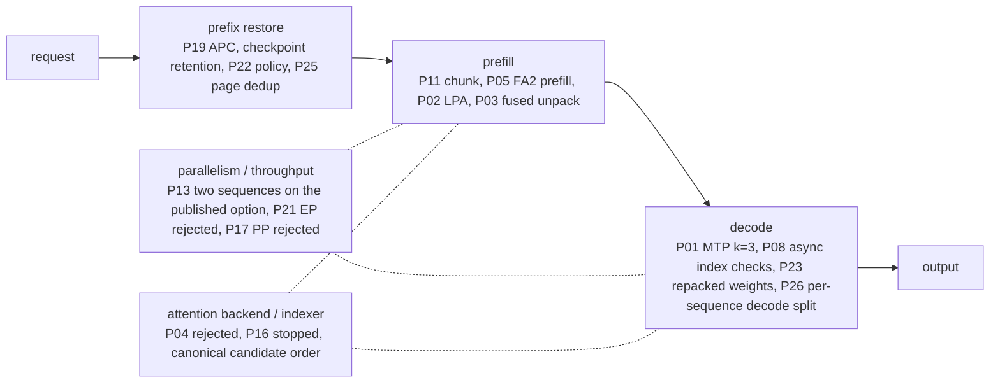

# Inference optimization overview

[日本語](optimization-overview.ja.md) · [Catalog](optimization-catalog.md) · [Document map](README.md)

One page showing which measure acts on which inference stage, where each one stands, and which profile fits which workload. The [catalog](optimization-catalog.md) owns initiative IDs and decisions; the linked measurement documents own the numbers.

## Baseline

The baseline is the [catalog's dated reference point](optimization-catalog.md#baseline-and-source-ownership) measured at context 16K with 1 GiB KV per rank ([initial matrix](benchmarks.md#initial-matrix)); see the separate [32K sweep](benchmarks.md#independent-context-sweep-through-32k-p15) and [release candidate measurements](benchmarks.md#release-candidate-measurements) for the earlier 200K combination; [256K checks](benchmarks.md#real-input-checks-at-256k) cover the text-only alternative with KV 3 GiB per rank, and [image input](vision.md) the current defaults.

## Where each measure acts

## Measures and current position

"Status" is the catalog's decision in a few words; the catalog row carries its dates, reasons and reopening criteria. "Default" is the value in the distributed defaults, `examples/server.example.toml` ([server configuration](server-configuration.md#distributed-defaults)); the published option's differences are listed in [the published option against the defaults](server-configuration.md#the-published-option-against-the-defaults). Functional acceptance, performance adoption, defaults and combined-mode acceptance are judged separately, so "adopted" does not mean enabled by default. See [profiles by workload](#profiles-by-workload) for what to enable per use.

### Prefix restoration (repeated conversations)

| Measure | Mechanism | Status | Default | Owner |
|---|---|---|---|---|
| P19 APC | Register only exactly computed state in the shared cache and skip prefill for an identical prefix | Accepted for measured serial long-prefix reuse (experimental); cold requests slightly slower | on (`cache.prefix_caching=true`) | [P19](benchmarks.md#independent-full-model-prefix-caching-p19) |
| Checkpoint retention (`cache.prefix_cache_retention_interval`) | Keep KDA checkpoints at every scheduler block so more prefix H is restorable after a mid-history edit or branch | Adopted for the exact-primed serial mid-edit workload. The measured arm was the native interval 4,352; `dense` uses the same native KDA mask in the measured aligned layout, and its final combined integration is qualified separately | `dense` (omitting the key preserves runtime default 0) | [Retention A/B/A](benchmarks.md#apc-history-retention-baseline) / [contract](launch-safety.md#apc-history-qualification) |
| P22 APC-first LPA | Approximate only beyond the restored H, and only when the remainder R = N − T − H exceeds threshold B; approximated state stays request-local | Completed (calibration, scoped quality, final combination and held-out). B = 128 is a conservative candidate threshold, not a universal crossover constant | APC on; LPA off (`lpa.break_even_tokens=128` applies when LPA is enabled) | [Design](apc-lpa-design.md) / [calibration](benchmarks.md#apc-first-lpa-crossover-measurement-p22) |
| P25 page dedup | Do not register a full block under a hash that already has a cached block, so a history re-sent under MTP stops evicting older ones | Adopted (1.9.0) | off; on in the published option (`runtime.prefix_page_dedup`) | [1.9.0](benchmarks.md#measurements-on-190) |

### Prefill

| Measure | Mechanism | Status | Default | Owner |
|---|---|---|---|---|
| P02 LPA | Skip historical MLP rows from layer 32 onward (zero-based cut); the last 512 tokens stay exact; generation runs all layers | Measured (experimental path; general quality is a separate gate); long-document checks and a tool round trip passed | off; batch opt-in (`lpa.enabled=true`) because an approximated request publishes no shared prefix; excludes FA2 prefill | [LPA](lpa.md) |
| P03 fused unpack | One Triton kernel for FP8 MLA cache unpacking (copy, FP32 conversion, scale multiply) | Measured (component parity and full-model A/B/A; used within the accepted P18 combined scope) | on (`cache.fused_unpack=true`) | [Component validation](component-validation.md) |
| P11 prefill chunk | Scheduler token budget compared with two sequences and on the 200K profile with one | Default 2048; 128 rejected; with two sequences a longer chunk lengthens the longest stall | 2048 (`context.max_num_batched_tokens`) | [P11](benchmarks.md#independent-prefill-chunk-evaluation-p11) / [200K](benchmarks.md#chunk-budget-on-the-200k-image-profile-2026-09-17) |

### Decode

| Measure | Mechanism | Status | Default | Owner |
|---|---|---|---|---|
| P01 MTP k=3 | Load the checkpoint's BF16 draft through a separate metadata view and speculate three tokens; no external draft model | k=3 selected on both checkpoints after depths 1–5 were measured; a depth from acceptance history, a confidence gate on the draft and two draft-side settings were measured and not adopted | on (`mtp.enabled=true`; `num_speculative_tokens=3`) | [depth three for both](speculative-decoding.md#depth-three-for-both-checkpoints-2026-09-21) / [beyond a fixed depth](speculative-decoding.md#beyond-a-fixed-depth-2026-09-21) |
| P08 async index checks | Keep range checks but move them to a GPU assert, trading host syncs and copies for a few more GPU kernels | Accepted (independent opt-in) | async (`runtime.index_checks`) | [P08](benchmarks.md#independent-cpu-synchronization-reduction-p08) |
| P06 CUDA Graphs | Capture/replay for decode only | Not adopted (2026-09-21): slower per step than eager on the full model; the option stays for a later runtime | off (`runtime.decode_graphs=false`) | [Graph fixture](component-validation.md#independent-decode-graph-fixture) / [full model](benchmarks.md#decode-graphs-on-the-full-model) |
| P23 repacked weights | The attention projections and `lm_head` repacked to W4A16 NVFP4 (route l), served through `runtime.derived_checkpoint` | Adopted as the published option; not lossless, so not in the defaults | off; on in the published option | [Catalog](optimization-catalog.md#performance-initiatives) / [serving profile](benchmarks.md#the-reference-pairs-serving-profile-attention-and-lm_head-repacked-depth-3) |
| P26 per-sequence decode split | Take the sparse-MLA decode's split from the tokens of one sequence instead of the whole step | Adopted (1.14.0): a request's attention no longer depends on the requests sharing its step | on (`runtime.mla_decode_cpb`) | [1.14.0](benchmarks.md#measurements-on-1140) |

### Parallelism and throughput

| Measure | Mechanism | Status | Default | Owner |
|---|---|---|---|---|
| P13 standard batching | Real batch overlap with `max_num_seqs=2`; LPA stays single-sequence | The published option serves two (accepted 2026-09-23, up to about 200K tokens each); completions repeat under any load only at one ([concurrency scope](validation.md#concurrency-scope)) | one sequence (`context.max_num_seqs=1`); two in the published option | [P13](benchmarks.md#independent-active-batching) |
| P21 Expert Parallel | Partition only expert layers by EP instead of TP | Not adopted for the measured throughput workload | off (`runtime.expert_parallel=false`) | [P21](benchmarks.md#independent-expert-parallel-evaluation-p21) |
| P17 TP2 / PP2 | Same two hosts as TP1 × PP2 | Not adopted for the measured generation workload | TP2 (`runtime.pipeline_parallel_size=1`) | [P17](benchmarks.md#independent-tp2-versus-pp2-evaluation-p17) |
| P14 same-task batching | Group submissions by task type | Not adopted for this workload | — (no setting) | [P14](benchmarks.md#task-grouping-order-comparison-p14) |

### Attention backend and indexer

| Measure | Mechanism | Status | Default | Owner |
|---|---|---|---|---|
| P04 NoPE attention fusion | Replace the Python query loop and multi-stage arithmetic | Rejected (fewer launches did not make it faster) | — (not wired into serving) | [P04](component-validation.md#nope-attention-fusion-and-query-batching-p04) |
| P05 FA2 prefill (SM121 backend selection) | Prefill-sized NoPE attention through FlashInfer's SM90 FA2 wrapper over rows unpacked to BF16; direct SM120 substitution was rejected | Adopted for prefill (1.6.0) | on (`runtime.fa2_attention`); decode on the reference path; excludes LPA | [1.6.0](benchmarks.md#prefill-and-decode-on-160) / [SM90 FA2](component-validation.md#sm90-fa2-mla-wrapper-probe) / [SM120 probe](component-validation.md#direct-padded-native-attention-probe) |
| P16 CSA2 | Cross-layer candidate reuse and restricted rescoring | Stopped at its first gate (2026-09-21): the indexer is too small a share of prefill; components retained | — (not integrated) | [CSA2](indexer-reuse.md) |
| Canonical candidate order | Sort sparse-MLA candidates into logical token order before physical index mapping, removing top-k order variation | Not a catalog initiative: a runtime fix every reference image carries; the initial comparisons above predate it | on (reference images) | [Candidate order](candidate-order.md) |

### Operations (not a performance measure)

Client authentication, allocator propagation, rail checks and the two-rank switch are operational contracts, not acceleration: the [catalog](optimization-catalog.md) files them under existing IDs and the [launch contracts](launch-safety.md) own them.

## Serial combination measurements

Combined profiles are measured as combinations.

- **P18** MTP3, fused unpack and async checks fixed; LPA off / on / restored compared. LPA adds about 15% / 19% at 2K / 8K with one output token and about 9% / 13% with 128 output tokens. Zero LPA-only regressions across 24 tasks. [P18](benchmarks.md#serial-integration-of-mtp-lpa-fused-unpack-and-async-checks-p18)
- **P22 final combination** adds APC and LPA cut 32 / tail 512 / B 128 with 2 GiB KV per rank. Strict scores 21 / 24 / 23 of 24; held-out eight documents 7 / 8 / 8. [P22 combined](benchmarks.md#apclpa-with-mtp-fusion-and-asynchronous-checks-p22)
- **Final regression with retention** adds `dense` retention on the final image and measures 2K / 8K (H = 0) and 16K (H = 4,608) at 128 output tokens, three runs each. Its repetitions and comparison differ from the retention A/B/A, so it is a regression check, not an adoption basis. [Final regression](benchmarks.md#final-combined-retention-regression)

## Profiles by workload

Enabling everything is not always fastest. When the same input is reused, the MTP-combined profile was slower than the MTP-free profile at 128 output tokens, because its MTP replay boundary reused less input. This compares whole profiles with different KV budgets and kernel settings, not an isolated cost of MTP. [Repeated-input tradeoff](benchmarks.md#repeated-input-tradeoff)

| Workload | Profile | Basis | Caveat |
|---|---|---|---|
| Generation-heavy, serial (code; the distributed defaults) | The pinned checkpoint, MTP k=3, fused unpack, async checks, FA2 prefill, APC, one sequence | [Distributed defaults](server-configuration.md#distributed-defaults) | Accepted for routine use with one sequence ([SETUP step 6](../SETUP.md#6-qualify-the-full-model)). Lossless with respect to the pinned weights |
| Japanese prose | The published option (NVFP4 BIZ AXL) | [The published option against the defaults](server-configuration.md#the-published-option-against-the-defaults) / [serving profile](benchmarks.md#the-reference-pairs-serving-profile-attention-and-lm_head-repacked-depth-3) | Not lossless; its cost is in the README comparison ([what has been verified](../README.md#what-has-been-verified)) |
| Batch prefill of long inputs | MTP k=3 + fused unpack + async checks + LPA cut 32 / tail 512, FA2 prefill off; APC optional | P18 / P22 final combination | LPA is a batch opt-in, approximate, excludes FA2 prefill and forfeits shared prefix reuse |
| Prefix-reuse-heavy | APC + LPA (P22, B = 128) + `dense` retention, no MTP | Repeated-input and mid-edit A/B/A | Grow the shared cache with exact priming; cold requests slightly slower |
| Throughput | Two sequences: the published option's example | [Concurrency scope](validation.md#concurrency-scope) | More throughput when requests overlap; completions depend on the co-scheduled requests; LPA is single-sequence only; more sequences need more ranks |
| Baseline / isolation | Everything off, eager, one sequence | Baseline benchmarks | For comparisons; not a qualified serving profile |

All are selected in the [server TOML](server-configuration.md) under `[mtp]`, `[lpa]`, `[cache]`, `[context]` and `[runtime]`, and require an image with the matching markers.

## Performance and capacity Q&A

These answers explain how to assess extensions of the current configuration. Both served profiles limit a request to 262,144 input-plus-output tokens; 1M means approximately one million tokens. 1M and more than two sequences are not qualified; two sequences are qualified only on the published option ([concurrency scope](validation.md#concurrency-scope)).

### Q. With 3 GiB of KV cache per rank, can the configuration consistently accommodate a 256K context?

**From a KV-capacity perspective, generally yes when the model, cache precision, MTP/LPA settings, parallel layout and single active sequence remain the same.** The text represented by a token does not change its KV format or size. Input plus generated tokens must stay within the limit. The [real-input 256K checks](benchmarks.md#real-input-checks-at-256k) establish capacity and limited retrieval for this configuration.

Changes to APC history, branching, checkpoint retention, block alignment or concurrency require checking the resulting state and allocations. Workspace and other processes' RAM usage can also vary. Distinguish KV fit from uninterrupted-operation guarantees. See [KV capacity and RAM requirements](server-configuration.md#kv-capacity-and-ram-requirements).

### Q. If 12.5 GiB of KV cache is available per rank, can it accommodate a 1M context?

**Not on two hosts with the pinned weights.** Without the derived checkpoint the launcher refuses more than 3 GiB of KV per rank (`check_kv_budget`), because the pinned weights leave the head too little room above the reserve ([KV capacity and RAM requirements](server-configuration.md#kv-capacity-and-ram-requirements)). The repacked weights load less and serve 6 GiB, the largest budget measured here; 12.5 GiB is untested and needs memory freed elsewhere (next question) or more ranks (TP=4, [concurrency scope](validation.md#concurrency-scope)).

The budget itself does not scale exactly with length from the 256K one: GLM combines token-dependent state with fixed recurrent state, block alignment and checkpoint retention, so check the pinned runtime's cache groups and state-slot counts. Weights, activations, indexer workspace, the OS and other allocations must fit outside that budget. Verify KV allocation, total host-RAM fit and completion of a real 1M request in that order.

### Q. Could disabling MTP and reducing the memory reserve make 1M operation feasible?

**It is the natural configuration to investigate, on the repacked weights or more ranks.** Disabling MTP releases [the draft's measured memory](speculative-decoding.md#measured-k1-results), a fixed cost that does not grow with context length. On the pinned weights the launcher still refuses KV above 3 GiB, with or without MTP.

Start from the published option's measured memory ([measurements on 1.10.2](benchmarks.md#measurements-on-1102)) rather than extrapolating from an earlier profile, establish the actual KV requirement and fit the extra long-context workspace as well. Lowering the reserve reduces retained headroom; it does not create more RAM.

### Q. How much waiting should users expect with a 1M context?

**First requests and requests without useful prefix-cache reuse can spend a long time processing the input (prefill); tens of minutes is plausible, not measured.** A ~200K request takes roughly three minutes on either served profile ([headline measurements](../README.md#what-has-been-verified)).

This is neither a measured 1M time nor a TTFT guarantee. Configuration changes, computational scaling, workspace and memory bandwidth may extend it further. A reusable prefix can sometimes reduce the wait, but repeatedly rereading a large input in conversation makes this latency a practical constraint.

### Q. Could 5 GiB of KV cache per rank make concurrent serving and EP or PP worthwhile?

**On the pinned weights 5 GiB is refused; the published option already serves two sequences from 6 GiB.** Its acceptance covers up to about 200K tokens each, with completions that depend on the co-scheduled request; two maximum-length requests together are not measured ([concurrency scope](validation.md#concurrency-scope)). LPA supports one active sequence. More sequences need more ranks (TP=4).

Larger batches may improve expert-compute efficiency or pipeline utilization, while communication and stage waiting can grow too. [EP](benchmarks.md#independent-expert-parallel-evaluation-p21) and [PP](benchmarks.md#independent-tp2-versus-pp2-evaluation-p17) were not adopted for performance on the measured workloads. Different concurrency and workloads merit reevaluation; a larger KV budget alone does not establish a speedup.

## Do not reinterpret

- Do not add or multiply gains from different experiments; images, inputs and KV budgets differ between them
- Do not promote a component or small-fixture pass to the full model
- Read functional acceptance, performance adoption, default on/off and combined-mode acceptance separately
- Distinguish initial pre-canonical-order comparisons from later full-model combined regression and release candidate measurements
- A perfect FreedomBench score, scoped task answers or fixture parity do not prove general quality or production reliability

## Next candidates

- P24 Per-request prefix-cache no-store: measured need, not started ([catalog](optimization-catalog.md#performance-initiatives))
- Euryale, a draft-proposer project outside this repository ([README](../README.md#related-research-outside-this-repository))
- P09 FP8 versus BF16 KV A/B, P20 indexer workspace, contexts beyond 256K and broader long-context coverage, multiple sequences with LPA
- The pinned vLLM: the source-pinned patches ([architecture](architecture.md)) go when a newer pin carries the upstream fixes; that move requalifies every measure above
